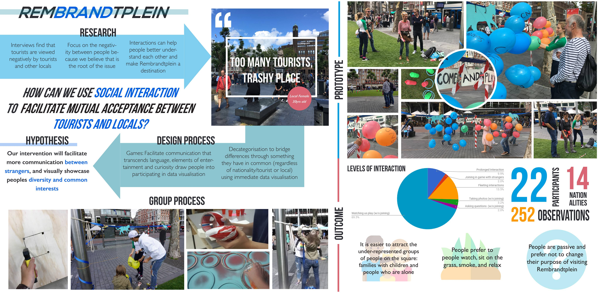
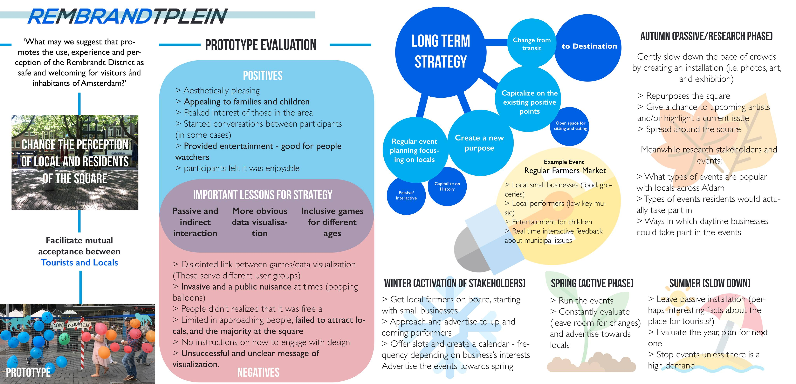

## Community Gardening Insights
This project focused on the psychological wellbeing of Scottish community gardeners and their development of mindfulness and connection with nature. Have a look at the [presentation](UG_pres.pdf) and [poster](CG_Poster_v2.pdf) created for the project.

## The Everyday City and Beyond 
In this summer project I worked with a multidisciplinary team to develop a solution for a busy touristy square in the middle of Amsterdam (Rembrandtplein). We designed and tested a prototype of an [intervention](Poster_3.pdf) aiming to bridge the gap (and the growing animosity) between locals and tourists. We then proposed a future [strategy](Poster_4.pdf) which was presented to the municipal leaders of Amsterdam.   

