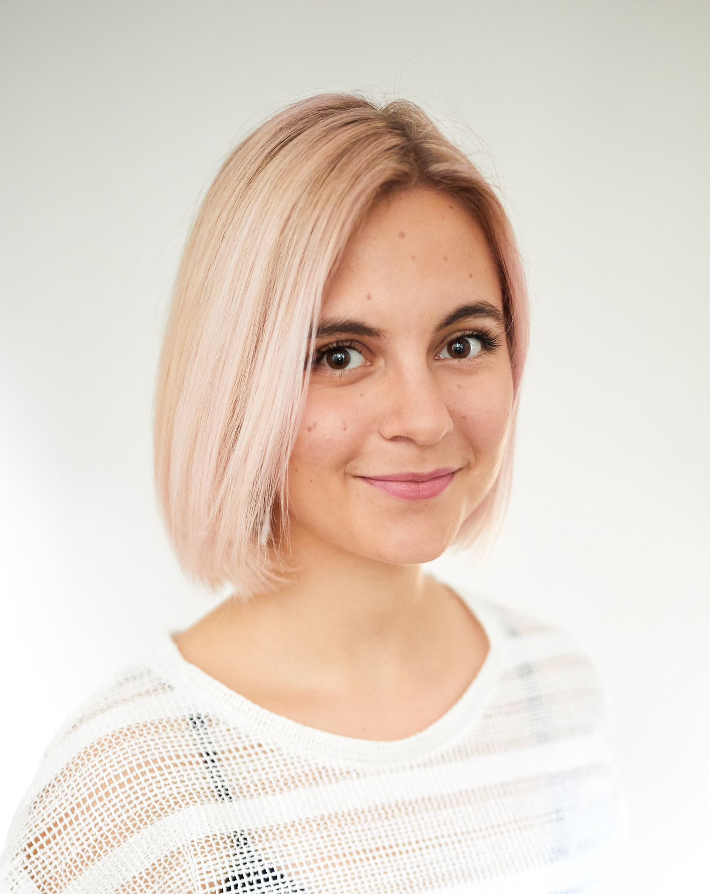

  

I graduated with MA (Hons) in Psychology in 2018 from the University of Glasgow. I continue my studies in the University of Glasgow's [Institute of Neuroscience and Psychology](http://www.gla.ac.uk/researchinstitutes/neurosciencepsychology/) as a postgraduate student. I work with [Dr Heather Cleland Woods](https://www.gla.ac.uk/schools/psychology/staff/heatherwoods/)
and we are currently investigating the interplay of sleep and social media in people with various sporting backgrounds as part of my MSc research project. 

##Research Interests
My main research focus is on sleep.  Alongside my academic efforts, I am part of a team developing an algorithm for prediction of bipolar relapses based on actigraphic data.   
Besides sleep, I am interested in other factors affecting human well-being, namely the lived environment, the effects of nature and its role in urban design, as well as physical activity and sports. I am passionate about research that can inform policies and can be transformed into effective interventions. See [Projects](Projects.html) to get an overview of what I have been working on outside of my degree.   